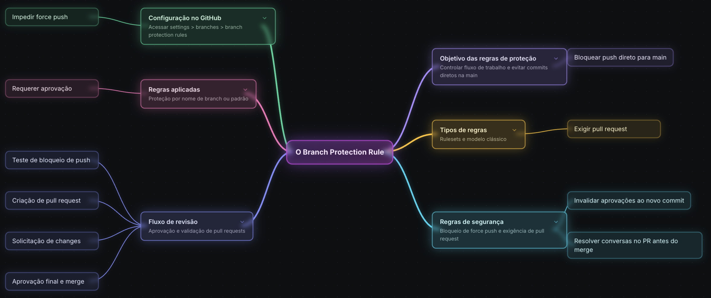

# Git Flow
O Git Flow ajuda a tornar o desenvolvimento mais colaborativo e paralelo. Em vez de todos os desenvolvedores trabalharem diretamente na mesma branch principal, cada pessoa pode criar uma branch própria para desenvolver uma funcionalidade, correção ou entrega específica. Isso reduz o risco de uma alteração incompleta impactar o trabalho de outras pessoas e mantém o histórico mais organizado. Mesmo que conflitos possam acontecer quando duas pessoas alteram o mesmo arquivo ou trechos próximos de código, esse tipo de problema passa a ser tratado no momento adequado, geralmente durante o pull request ou merge.

Dentro desse modelo, existem branches principais e branches de suporte. As branches principais costumam representar os estados mais importantes da aplicação. A main é tratada como a branch produtiva, onde deve estar o código que representa a versão em produção. Já a develop concentra o desenvolvimento ativo, servindo como base para novas funcionalidades e como ponto de integração antes de o código avançar para ambientes mais próximos de produção. Em alguns processos também pode existir uma branch intermediária, como staging, qa ou homologação, usada para validação por times de negócio ou qualidade antes da entrega final.

As branches de suporte são usadas para organizar trabalhos temporários. Uma branch do tipo feature nasce normalmente a partir da develop e concentra o desenvolvimento de uma funcionalidade específica. O objetivo é trabalhar nessa alteração de forma isolada, fazer os commits necessários e, quando estiver pronta, abrir um pull request para integrar o conteúdo de volta na develop. Dessa forma, a branch de desenvolvimento recebe apenas alterações já revisadas ou ao menos preparadas para integração.

Também há o conceito de branch release, usada quando um conjunto de funcionalidades já está pronto para compor uma nova versão da aplicação. Em vez de tratar cada mudança isoladamente, a release agrupa várias features estáveis que farão parte de uma versão maior, como uma V2 da aplicação. Esse tipo de branch ajuda a organizar a preparação de uma entrega, permitindo ajustes finais antes de levar o conteúdo para produção.

Outro tipo importante é a branch de hotfix, usada para correções urgentes em produção. Nesse caso, a branch costuma ser criada diretamente a partir da main, porque o problema está no código produtivo e precisa ser resolvido rapidamente. Depois que a correção é feita, testada e integrada de volta na main, é importante também atualizar as demais branches, como develop ou staging, para que elas não fiquem defasadas em relação ao que foi corrigido em produção.

## Pull Requests
Um pull request pode ser entendido como uma solicitação para que uma alteração feita em uma branch seja analisada e integrada em outra branch. Na prática, ele funciona como um ponto de revisão antes de uma mudança entrar em uma linha principal do projeto, como develop, main ou qualquer outra branch usada pela equipe.

A ideia do pull request está diretamente ligada ao desenvolvimento colaborativo. Quando uma pessoa cria uma branch para desenvolver uma melhoria, corrigir um bug ou implementar uma funcionalidade, ela não precisa colocar essa alteração diretamente na branch principal. Em vez disso, ela abre um pull request, descreve o que foi feito e solicita que aquela mudança seja avaliada. Isso permite que outras pessoas entendam a proposta, revisem os arquivos modificados, comentem trechos específicos e decidam se a alteração pode ou não ser integrada.

Quando uma branch contém commits ou arquivos diferentes em relação a outra, a plataforma exibe a possibilidade de abrir um pull request. Por outro lado, quando duas branches já estão equivalentes, ou seja, sem diferenças a serem integradas, o GitHub não permite criar um pull request entre elas porque não há nada novo para comparar ou aplicar.

Para enxergar esse processo em um cenário mais próximo do mundo real, podemos considerar um projeto comunitário com vários pull requests abertos e fechados. Esse tipo de projeto mostra bem a importância do pull request em ambientes onde muitas pessoas podem contribuir ao mesmo tempo. Sem esse mecanismo, seria muito difícil controlar alterações enviadas por diferentes pessoas, manter a qualidade do código e organizar discussões sobre cada proposta de mudança.

Um pull request bem feito precisa ter um título claro e uma descrição útil. O título deve indicar de forma objetiva o que está sendo resolvido, enquanto a descrição deve explicar o contexto da alteração, o tipo de mudança e, quando necessário, os detalhes técnicos do que foi modificado. Em projetos maiores, especialmente projetos open source, é comum existir um arquivo de contribuição explicando como os pull requests devem ser enviados. Esse arquivo pode definir padrões de branch, formato de descrição, tipo de mudança, testes esperados e regras para revisão. Seguir essas orientações é essencial, porque mesmo uma alteração tecnicamente boa pode ser recusada se não respeitar o processo definido pelo projeto.

Dentro de um pull request, é possível analisar os commits enviados, os arquivos alterados e as diferenças entre a versão atual da branch de destino e a versão proposta. Essa comparação facilita muito a revisão, porque mostra exatamente quais linhas foram adicionadas, removidas ou modificadas. Além disso, o pull request concentra a discussão sobre aquela mudança em um único lugar. Caso algo não esteja adequado, outras pessoas podem pedir ajustes, sugerir melhorias ou questionar decisões antes que o código seja integrado.

## Branch Protection Rule
Aqui vamos ver como usar regras de proteção de branch no GitHub para controlar melhor o fluxo de trabalho com git flow e pull requests. A ideia principal é impedir que alterações cheguem diretamente na branch principal sem passar por um processo mínimo de revisão. Esse tipo de configuração ajuda a transformar o fluxo combinado anteriormente em uma regra aplicada pelo próprio repositório, e não apenas em uma combinação informal entre as pessoas do time.

Começamos nas configurações do repositório, na área de branches e regras de proteção. O GitHub oferece o modelo clássico de branch protection rules e também o modelo mais novo de rulesets. O foco fica nos rulesets, que permitem criar regras aplicadas a branches específicas, à branch padrão ou até a padrões de nomes, como branches de staging, hotfix ou qualquer outra nomenclatura usada pelo time. No exemplo, a regra criada recebe o objetivo de bloquear push direto para a main, que é a branch principal do repositório.

Durante a criação da regra, é possível definir o status de aplicação da regra, selecionar quem poderia fazer bypass e escolher o alvo da proteção. A branch protegida foi a branch padrão, representando a main. Isso significa que qualquer tentativa de alteração direta nessa branch precisa respeitar as condições configuradas no ruleset.

Entre as opções de proteção, uma das mais importantes é bloquear force push. Essa configuração evita que alguém reescreva o histórico da branch protegida usando um push forçado. Em branches críticas, como main, isso é especialmente importante porque um force push pode remover commits, sobrescrever histórico e dificultar a rastreabilidade das mudanças. Outra regra essencial é a exigência de pull request antes do merge. Com isso, uma alteração vinda de develop para main, por exemplo, não pode ser integrada diretamente: ela precisa passar por um pull request.

Também podemos configurar a exigência de pelo menos uma aprovação no pull request. Essa aprovação funciona como uma etapa de revisão: outra pessoa precisa olhar a alteração e aprovar antes que o merge seja liberado. A configuração pode exigir mais de um aprovador, dependendo do tamanho do projeto e do nível de controle necessário. Esse tipo de regra aproxima o repositório de um fluxo mais profissional, porque impede que mudanças importantes entrem sozinhas em uma branch protegida.

Outro detalhe importante é a opção que invalida aprovações anteriores quando novos commits são adicionados ao pull request. Isso faz sentido porque uma aprovação dada para uma versão anterior do código não deveria necessariamente continuar válida depois que novas mudanças são enviadas. Assim, se alguém aprovar um PR e depois o autor adicionar outro commit, a revisão precisa considerar o conteúdo mais recente. Também vale comentar a possibilidade de exigir que conversas abertas no pull request sejam resolvidas antes do merge, o que evita integrar mudanças enquanto ainda existem discussões pendentes.

